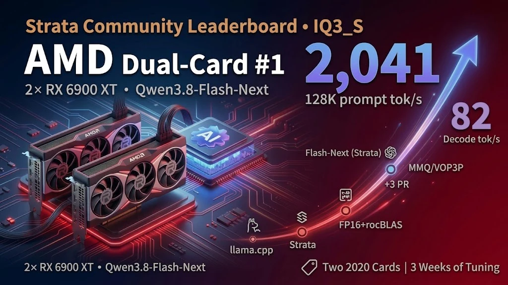
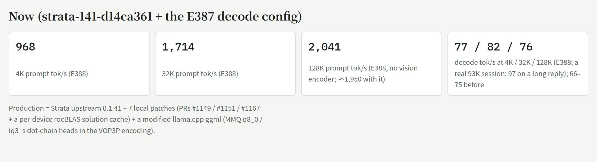
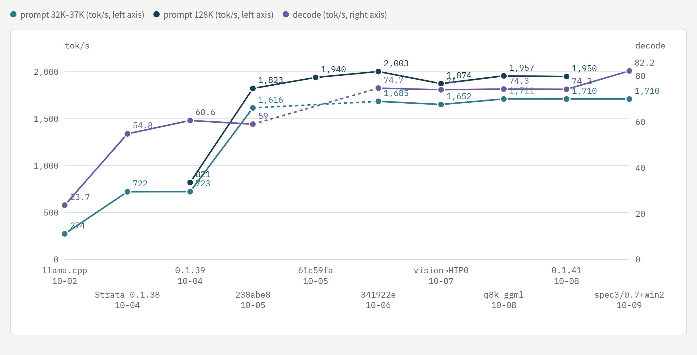
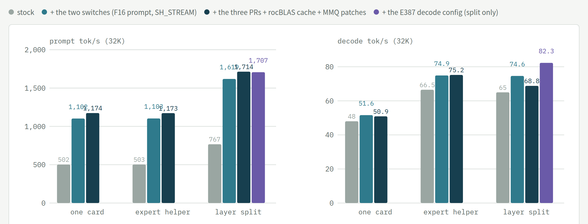
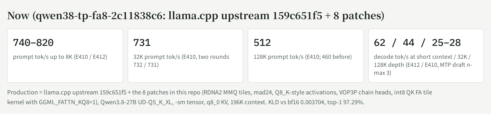
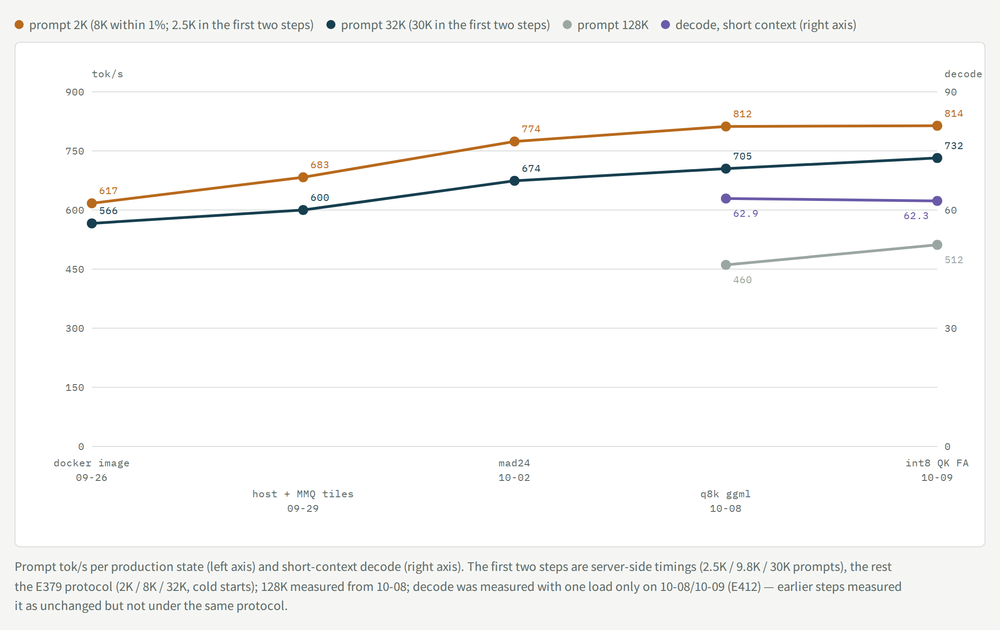
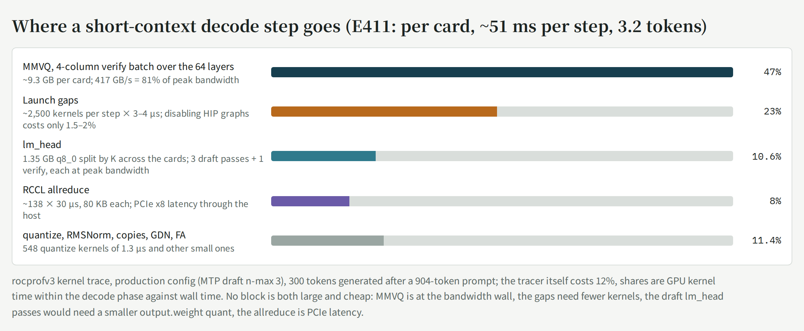

# dual-6900xt-flash-next-tuning

[中文](README.zh-CN.md) · **Interactive timeline: https://vop3p.github.io/dual-6900xt-flash-next-tuning/** (Chinese; every step filterable by line of attack)

<picture>
  <source media="(prefers-color-scheme: dark)" srcset="docs/now-en-dark.png">
  
</picture>

<picture>
  <source media="(prefers-color-scheme: dark)" srcset="docs/speed-chart-en-dark.png">
  
</picture>

*Prompt tok/s at 4K, 32K–37K and 128K (left axis) and decode tok/s (right axis) at each production state. Points come from different experiments under slightly different conditions (the 4K points of the first two steps are 5K prompts; the notes under the chart on the interactive page list the rest); a dashed segment bridges a step where that metric was not measured.*

Tuning log for **Qwen3.8-Flash-Next (GSQ-RCO IQ3_S)** on a home box with **2x AMD RX 6900 XT (gfx1030, PCIe 4.0 x8 each) / Ryzen 5 5600X / 128 GB DDR4**, ROCm 10.0 — from llama.cpp to [Strata](https://github.com/Niko1221/Strata), 2026-09-21 → 10-08. Experiment numbers (E…) refer to the author's lab notebook (not public). Every number is measured on this machine unless marked as an estimate.

**`patches/llama.cpp/`** — eight llama.cpp patches on upstream `159c651f5`: 1–7 are the RDNA2 MMQ work behind the `q8k ggml` step (wider tiles, mad24 scales, Q8_K-style activations, VOP3P dot-chain heads), 8 is an int8 QK^T flash-attention tile kernel for a q8_0 K cache; build flags and measured effects in [their README](patches/llama.cpp/README.md). Strata picks the MMQ ones up through `-DSTRATA_GGML_DIR`. They were made on the dense **Qwen3.8-27B** that the same two cards serve through llama.cpp — that line of work is in [section 4](#4-the-dense-27b-on-the-same-box-qwen38-27b-ud-q5_k_xl-on-llamacpp-qwen38-tp).

**License:** the llama.cpp patches (`patches/`) and the scripts (`bench/`) are MIT, the same license as llama.cpp, so they can be taken, merged and shipped; the text, figures and measurement data are CC BY-NC 4.0 (attribution, no commercial use). See `LICENSE`. `CITATION.cff` has a citation entry.

<picture>
  <source media="(prefers-color-scheme: dark)" srcset="docs/modes-chart-en-dark.png">
  
</picture>

*One card vs expert helper vs layer split (E388 / E388a, 0.1.41, 32K prompts, no vision encoder): a 16 GB card alone decodes at 48–52 whatever the tree (about 4,500 expert slots, 83% hit rate); the helper mode lifts decode to 66–75 at one card's prompt speed; the split lifts both, and the E387 decode configuration adds the last step to 82.*

## 0. Where it stands

- **Production (binary since 10-08 21:25, decode config since 10-09 00:16):** Strata upstream 0.1.41 + 7 local patches (upstream PRs #1149 / #1151 / #1167 + a per-device rocBLAS solution cache) + a modified llama.cpp ggml (MMQ dot-chain heads in the VOP3P encoding on RDNA2). Two-card layer split, IQ3_S experts, int8 KV, MTP `--spec 4 --spec-min-p 0.5`.
- **Speed (production config):** prompt 968 / 1,714 / 2,041 tok/s at 4K / 32K / 128K, decode 77 / 82 / 76 (E388: the production binary with `--spec 3 --spec-min-p 0.7 --pipeline-windows 2`, no vision encoder; with the encoder loaded 128K is ≈1,950, 4K/32K the same); a real 93K-context session decoded a long reply at 97 tok/s. Decode was 66–75 before.
- **Whole journey, same IQ3_S model:** decode 26 → 66–75 tok/s (≈2.7×), 37K/50K prompt 274 → ~1,700 tok/s (≈6×). The engine switch (llama.cpp → Strata) is most of it; the patches and configuration after that add about +50% prompt (714 → 1,433 → 1,705 → 1,711) and about +20% decode.
- **Closed directions (measured; do not retry on this box):** every decode-side configuration knob — `--kv-resident` shrink (E382), `--pipeline-windows 2` alone (E384, +1–6%), the 16-point `--spec` × `--spec-min-p` grid at `--pipeline-windows 1` (E385, 4/0.5 is the peak of accepted tokens per window) — **but the combination works**: `--spec 3 --spec-min-p 0.7 --pipeline-windows 2` decodes +10–16% at 4K and +8–11% at 32K (E387, three confirmation rounds; the short draft is accepted 83% of the time instead of 68%, so the speculative second window hits). Prompt speed unchanged; output differs between starts (the baseline is deterministic); 128K +11% in the no-vision-encoder configuration (E388); in production since 10-09 00:16; batch slots (resident experts 41% < upstream's 50% gate, slots decode without MTP); MMQ tile / stream-K for IQ3_S (E279/E280); `--prefill` chunks other than 8192 (E296); tensor parallel (E234, +6%); and the upstream opt-ins that upstream itself measured as neutral or negative on small cards (chunked GDN, Foresight swap slots, pinned stage buffers).
- **What is left:** the PCIe topology (x16 + x4 would give ~1.5× on long prompts but breaks RCCL tensor parallel for the dense 27B model on the same box — a trade the owner has not made); and kernel-level work on the prompt side, where expert GEMM, GDN, QSA attention and the hc read each take 10–15% (≤10% each at best).

## 1. Timeline

| Date | Step | Measured effect |
| --- | --- | --- |
| 09-21/22 | llama.cpp expert cache (E140–E146): cache 56, inserts 8, MTP n-max 2 | 120K decode 10.9 → 13.0 tok/s; cache chains > 4 tokens crash in MMQ |
| 09-26 | `GGML_OP_OFFLOAD_MIN_BATCH=136`; PLE direct-read build | cold 8K prefill +13–18%, major page faults gone |
| 09-27 | E165 expert copies over both x8 links | only +1–4%: layers are serial; true pipelining needs a new scheduler (not done) |
| 09-29 | QSA gather (`LLAMA_QSA_GATHER=1`) | 96K: −9.6% per verify step; gather only applies to decode/MTP |
| 09-30 | new alias with GSQ-RCO IQ3_S + 112 cache slots | decode −19–20% per step, prefill +17–22% vs UD-Q4; 77% hit rate |
| 10-01 | upstream MTP vs our dense MTP; Vulkan | no measurable difference; Vulkan 55–90% slower, dropped |
| 10-02 | production llama.cpp build with 137 slots (upstream 159c651f5) | 10–18% faster per step than 112 slots; numerical noise floor KLD ≈ 0.025 |
| **10-04** | **Strata arrives** (E215/E216, HIP gfx1030) | same IQ3_S, 5K prompt: decode llama.cpp 26 → split 56–58 → helper 62–63; 37K prefill 274 → 714 |
| 10-04 02:30 | strata-split / strata-helper live (132a522; HIP: FP16 output GEMM, QSA S4) | 37K prefill split 1,433 / helper 978 |
| 10-04 17:00 | 0.1.39 (6add1a7) + FP16 prompt path → PR #835; #849 / #854 | 9.9K split 906 tok/s; helper needs `--pcie-frac 0` |
| 10-04 21:00 | prompt stall at layer 1 reproducible (~70%) → `--adapt-every 100000` | 0/3 stalls; root cause found 10-06 |
| 10-05 | stall root-cause chain (E251–E264, issue #884): MMQ + primary-card adapt + SDMA together; CP does not release a BARRIER_AND | disabling any one avoids it; one HW queue: 0 stalls but prompt −30% |
| 10-05 15:32 | production strata-238abe8 (0.1.39 + #835/#849/#854/#981 rocBLAS table) | 50K prompt 1,495 → 1,705 (+13–16%), decode unchanged |
| 10-05 19:05 | `STRATA_IO_THREADS=128` + `--ple-io ram` (memlock unlimited) | first-chunk PLE wait 568 → 10 ms, 8K prompt −7.4% latency |
| 10-05 20:25 | production strata-61c59fa (+#1007 select SGEMM) | 128K prompt +5% |
| 10-06 06:33 | **#884's strongest lead: GFXOFF** (0/10 stalls with it off); the knob is a refcount (corrected 11:05) | first a gfxoff guard, later kernel-copy |
| 10-06 09:42 | 0.1.40.1 baseline (E335) | split prompt 745 → 1,455 (F16), decode 58.6 → 64.5 (SH_STREAM) |
| 10-06 18:04 | production strata-341922e (0.1.40.1 + #1149/#1150/#1151 + rocBLAS table; env SH_STREAM=1, PROMPT_F16=1) | 128K split 2,003 tok/s |
| 10-06 19:10 | `STRATA_HIP_ADAPT_KERNEL_COPY=1` avoids the 128K split stall; gfxoff guard removed (power) | 0/3 vs 3/3 stalls, no speed cost |
| 10-06 22:20 | images on both split slots (self-built HIP strata-vision) | primary-card cache −11%, 32K prompt −3.6% |
| 10-07 16:54 | production strata-4592281 (0.1.40.2 + per-device rocBLAS solution cache) | speed flat; solutions no longer change between starts |
| 10-07 evening | #1151 reworked as the SIMT scorer (upstream 65ce329 ported to HIP) | 128K prompt +7.4%, byte-identical scores |
| 10-07 22:10 | vision encoder moved to HIP0 (split 0–26 / 27–47, primary cache 5,256 → 6,123 slots) | 32K prompt +2.8–3.8% |
| 10-08 | strata-ud-q4 slot (UD-Q4_K_XL, K-quant MMQ running on HIP) | decode −38%, 32K prompt −3% vs IQ3_S; kept only for quality comparison |
| 10-08 19:25 | production strata-q8k-4592281: ggml from the modified llama.cpp (MMQ q8_0 / iq3_s dot-chain heads in VOP3P, E378) | iq3_s kernel +2.6% → 32K prompt +1.4–1.5%, outputs byte-identical |
| 10-08 20:30 | E382 `--kv-resident` 32K → 16K | expert slots only +0.7%, 32K decode −3%, dropped |
| 10-08 21:25 | **production strata-141-d14ca361**: upstream 0.1.41 + the 7 patches rebased (clean) | 12 outputs byte-identical, speed ±0.5%, 0 stalls; json gets `gpu_order: as_given` |
| 10-09 04:47 | E391–E394: four outside leads, all negative | `--prefill auto:16384` (#1640) 32K −14%; a 4K prompt as two 2,048 chunks (#1441's idea) −9%; #1123's FP32 SGEMM never runs with the FP16 route on, +66/+73% with it off (already measured 10-06 on its predecessor, cited in the PR); phase timing: FP16 twice as fast on hc read and qsa proj, no route merge |
| 10-09 04:03 | E388a: 0.1.41 one-card / helper arms (completes the report) | one card PRs 976/1,174/1,147, decode 49–51; helper PRs 986/1,173/1,147, decode 72–75; stock +3–6% over 0.1.40.1, switches +5–13%, PRs +1–2%; zero stalls |
| 10-09 00:16 | **E387 config in production** (`strata-split` / `-256k`: `--spec 3 --spec-min-p 0.7 --pipeline-windows 2`, backups `*.bak-2026-10-09-before-e387`) | one real 7K request through llama-swap: confirm line present, split 0–26/27–47, prompt 1,019, decode 73.4, 92% drafts accepted |
| 10-09 00:13 | E388 0.1.41 community report (5 split arms, no vision encoder) | stock 0.1.41 vs 0.1.40.1 stock: prompt +4–6% (464/767/869); the two switches +5/+12/+12% (832/1,619/1,823); PRs unchanged (968/1,714/2,029); kernel-copy free, stock 128K no stall; the E387 decode config +19/+20/+11% (77/82/76) |
| 10-08 23:42 | E387 `--spec 3 --spec-min-p 0.7 --pipeline-windows 2` | decode 4K 66 → 73–77, 32K 74 → 80–83 (+8–16%, 3 rounds), prompt unchanged; output non-deterministic across starts; candidate |
| 10-08 21:27 | E384 `--pipeline-windows 2` | decode +1–6% but outputs differ between starts (2/7 same), 4K prompt −1–5%; dropped |
| 10-08 21:50 | E385 `--spec` × `--spec-min-p`, 16 points | only 5/0.6 at 32K +2.5% (single run); the rest negative; 4/0.5 kept |
| 10-08 22:50 | batch slots evaluated | resident experts 41% < upstream gate 50%; slots decode without MTP; not for this box |

## 2. What was learned about the mechanisms

- Strata's expert prompt GEMMs *are* llama.cpp's MMQ kernels (`moe_mmq.cu`), so llama.cpp-side MMQ changes can be carried into Strata through `STRATA_GGML_DIR`; the rocBLAS table and the SIMT scorer only cover the dense projections and QSA scoring.
- Decode: one verify window is ≈ 33 ms of fixed cost (the two cards' layer stages run one after the other), so speed = accepted tokens per window ÷ window time. Longer drafts or a lower min-p lower the acceptance rate; shorter drafts or a higher min-p cut the window short; 4/0.5 sits on the peak.
- Flash-Next's resident KV window is only ~100–200 MB; VRAM is dominated by the expert cache (6,123 slots on the primary card), and both prompt and decode speed follow the slot count.
- Strata can stream KV from RAM because QSA attention is sparse (98.7% of block reads hit VRAM); a full-attention model (the dense 27B on the same box) has no such path.
- The GFXOFF ↔ ROCm CP-barrier interaction is the root of the stalls (#884, drm/amd #5945); the mitigation is kernel-copy, not the guard.
- The layer-split point is a decode knob on its own: without the vision encoder the second card has 1.7 GiB more free, the auto split moves from 0-26/27-47 to 0-24/25-47 and 32K decode drops 74 → 69 (−8%) while the hit rate goes up; with `--pipeline-windows 2` both splits reach 82 (E388). A manual `layer_split` sweep has not been done.

## 3. Mistakes made along the way (kept so they are not repeated)

- Treated the `amdgpu_gfxoff` knob as a level when it is a refcount; every "default on" arm of E335–E338 was invalid (10-06).
- Misread the split timing lines: the "whole call" card's `embed+steps` includes waiting for the other card (E361).
- Assumed the resident KV window was a large share of VRAM and ran E382 before doing the arithmetic (+40 slots).
- Read an upstream PR's whole body and grep your own log for it and its predecessor before measuring it: three rounds on #1123 before noticing we had measured its predecessor #1006 on 10-06 and the PR cites our numbers (E392).
- Declared `--pipeline-windows 2` and the spec grid closed after one single-variable sweep each (E384/E385); the two knobs interact and the combination is +10–16% (E387).
- Expected +10–30% from `--pipeline-windows`; measured +1–6% with non-deterministic output — the estimate ignored that the guess rate is bounded by 2.3 accepted tokens per window.
- Upgraded to 0.1.39 without checking the old build's local patches one by one; helper decode fell to 39 tok/s (10-04 19:40).
- Built a comparison tree without diffing CMakeCache and lost a bisection to a missing `STRATA_PREFILL_MMQ=ON` (10-04).

## 4. The dense 27B on the same box: Qwen3.8-27B (UD-Q5_K_XL) on llama.cpp, `qwen38-tp`

The same two cards also serve the dense Qwen3.8-27B through llama.cpp: `-sm tensor` (RCCL allreduce over the two x8 links through the host), q8_0 KV, 196K context, MTP draft (`--spec-draft-n-max 3`), three slots. Full attention, so none of Strata's expert/KV-streaming tricks apply; this is where the llama.cpp patches above were made, and patch 8 only exists for it. It is not on the interactive timeline page.

<picture>
  <source media="(prefers-color-scheme: dark)" srcset="docs/q38-now-en-dark.png">
  
</picture>

**Where it stands (10-09 15:10):** production binary = upstream `159c651f5` + patches 1–8, env `GGML_FATTN_KQ8=1`. Prompt 740–820 tok/s up to 8K, 731 at 32K, 512 at 128K; decode 62 tok/s at short context (MTP: ~3.2 accepted tokens per 51 ms step), 44 at 32K depth, 25–28 at 128K. KLD vs bf16 0.003704, top-1 agreement 97.29% (stock kernels on the same quant: 0.003941 / 97.32%). Needles 8/8 at 32K, 4/4 at 128K. VRAM 15.8 GB per card at 196K.

<picture>
  <source media="(prefers-color-scheme: dark)" srcset="docs/q38-speed-en-dark.png">
  
</picture>

| Date | Step | Measured effect |
| --- | --- | --- |
| 09-26 | E157: v3 UD-Q5_K_XL chosen over UD-Q4_K_XL (KLD vs a 54 GB bf16 reference, 64×512 mixed zh/en) | 0.0039 vs 0.0116; Q4 would be +10.5% faster and 1.2 GiB/card smaller; precision chosen |
| 09-27 | E152: reproducing the production numbers on the host | `--cache-ram 0` switches off idle-slot caching and, with `-kvu`, slows new requests 30–40% — nearly four false conclusions; copy every parameter, caches included |
| 09-29 | host binary instead of the docker image; RDNA2 K-quant MMQ tiles (patch 2; a K512 variant was 1.9× on the sweep and wrong on real shapes) | prefill 2.5K 617→683, 9.8K 623→677, 30K 566→600; bit-identical; decode unchanged |
| 10-02 | mad24 scale multiplies (patch 3) | prefill +8–9%, bit-identical, decode −1% |
| 10-02 | E200b phase timing, 10K prefill: MMQ 64–67%, RCCL ≤13%, FA 5%, GDN 5% | K-quant MMQ ~40% slower than q8_0 because of per-sub-block float scales → the activation layout became the target (done 10-08) |
| 10-08 | Q8_K-style MMQ activations + VOP3P dot-chain heads (patches 4–6) | prefill +4.6–6.1% (2K 774→812, 8K 773→811, 32K 674→705); KLD 0.003941→0.003736; dead ends: 256 values per scale (+25% KLD), k01 unroll (>1000 VGPR), VOP3P heads on q4_K/q5_K (−10%) |
| 10-08 | E377 kernel-level timing: MMQ 60–72%, allreduce 14–16% (BF16, 2 per layer, already at PCIe speed), FA 2% at 2K → 17% at 32K, GDN 5–6% | FA is the long-context target |
| 10-08 | E381 FA tile kernel sweep (nbatch_fa, nbatch_K, occupancy, threads; 10 points) | upstream defaults are the local optimum on gfx1030; no point >+3%; the kernel sits at 35% of fp16 peak by structure (LDS reuse per 32 columns × 64 keys, half2 packing), not by parameters |
| 10-09 | **int8 QK^T in the FA tile kernel** (patch 8; E406–E410, one day) | kernel 1.31× at 16K/64K; end to end prefill 32K +3.3–3.9%, 128K +11.1%, 2K/8K flat; decode/VRAM unchanged; KLD 0.003704; in production 15:10 |
| 10-09 | E411 decode phase timing (short context, production config, rocprofv3; the tracer itself costs 12%) | pie below; MTP is worth 2.1× (25.7 → 62 tok/s); HIP graphs are in use but worth only 2% (E411b) |
| 10-09 | E412 old vs new binary at short context | decode 62 ±1% both, 904-token prompt flat — patch 8 does not touch decode |

**Where a short-context decode step goes (E411, per card per ~51 ms step, 3.2 tokens):**

<picture>
  <source media="(prefers-color-scheme: dark)" srcset="docs/q38-decode-en-dark.png">
  
</picture>

| Block | Share | Distance from the hardware |
| --- | --- | --- |
| MMVQ, 4-column verify batch over the 64 layers (~9.3 GB of weights per card) | 47% | 417 GB/s = 81% of peak bandwidth |
| Launch gaps (~2,500 kernels per step × 3–4 µs) | 23% | the `-sm tensor` meta backend splits each step into ~130 sub-graphs (one per allreduce), so each HIP graph holds a dozen kernels — disabling graphs costs only 1.5–2% |
| lm_head (1.35 GB q8_0, split by K across the cards; 3 draft passes + 1 verify pass) | 10.6% | each pass at peak bandwidth; the three draft passes are 8% |
| RCCL allreduce (~138 × 30 µs, 80 KB each) | 8% | latency-bound on PCIe x8 through the host |
| quantize (548 × 1.3 µs), RMSNorm, copies, GDN, FA | ~10% | small kernels |

No block is both large and cheap: MMVQ is at the bandwidth wall, the gaps need fewer kernels (fusion of the 1–4 µs kernels, +5–8% expected) or the allreduce inside the graph (a backend change, +15–20% at best, not measured), lm_head drafts would need a smaller `output.weight` quant (touches the main model), the allreduce is PCIe latency.

**Closed directions on the 27B (measured):** SGLang at the same bit width is not faster single-stream (E174, the earlier +6–12% was Q4 vs Q5); Vulkan; `-ub 2048` (+4–8% prompt but context must drop to 131K); `-np 1` (no single-stream gain); the FA tile parameter space (E381); MMVQ (at 81% of bandwidth); HIP graphs on/off (2%).

**Mistakes on this line:**

- `--cache-ram 0` in a host reproduction (E152) nearly produced four wrong conclusions; every cache parameter has to be copied.
- The int8 prototype's first four versions (1.04–1.11×) were read as the idea's ceiling; they were a register spill (256 VGPR + 31 spills) from keeping the Q scales in registers. Read the ISA/VGPR count before judging a kernel idea.
- The int8 precision blow-up (KLD 0.059, max 20) was chased for hours in the quantiser (outlier dims, rotations, SmoothQuant) — the cause was `launch_fattn`'s split-KV combine path, which the int8 kernel's LDS footprint had switched on; the upstream f16 kernel forced through the same path also loses precision. Read the launcher before touching the quantiser.
- Two experiment chains sharing one script and build directory produced binaries that were not what the log said (two readings thrown away); one chain at a time.
- Stacked `sed` macro edits deleted a real `#define`; macro variants belong in separate commits.
- Under rocprofv3, `llama-server` ignores SIGINT/SIGTERM (the tracer's handler); the trace database had already been written, and 30 minutes were spent waiting. SIGKILL after the database appears.
- E411's falsification criterion ("kernel time < 60% of wall time") was met and still did not answer "which block to cut"; the criterion should have been "largest block ≥30% and ≥25% from its hardware limit".

## 5. Repository contents

- `index.html` — the interactive timeline (speed chart of every production state + every step with reason and effect; Chinese; Flash-Next only).
- `bench/results/e410`, `e411`, `e412` — the 27B raw material: the P/F cold-start A/B of patch 8 (scripts, report, KLD/perf run), the rocprofv3 decode pies and gap analysis (scripts and their text output; the 300–800 MB trace databases are not included), the old/new short-context check.
- `bench/run_ab.sh` — A/B skeleton: one cold server per arm, full logs, confirmation lines; `benchmark.py` load generator (4K/32K/128K prompts, fresh nonce each), `ab_compare.py` pairwise text/speed comparison, `monitor_amd.py` telemetry sampler. Paths are placeholders.
- Upstream community reports from this box: Strata PR #927 and #1270.

Developed with an AI coding assistant; every number here was measured on 2x RX 6900 XT (gfx1030, PCIe 4.0 x8 each) / Ryzen 5 5600X, ROCm 10.0.
