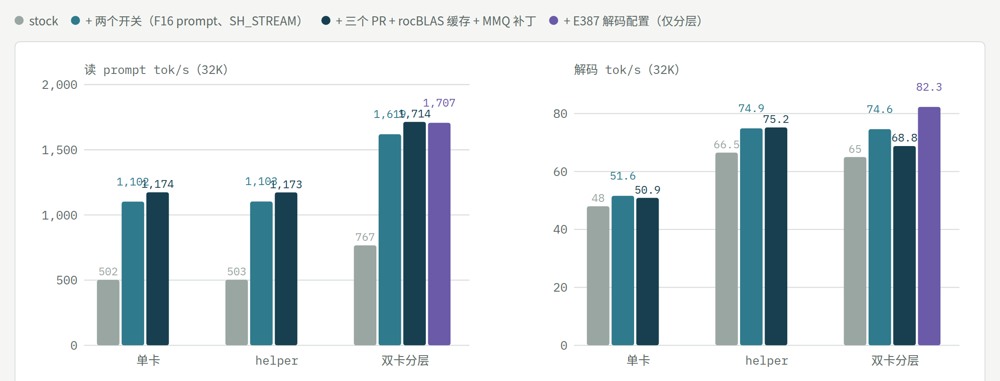
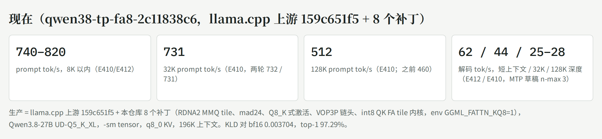
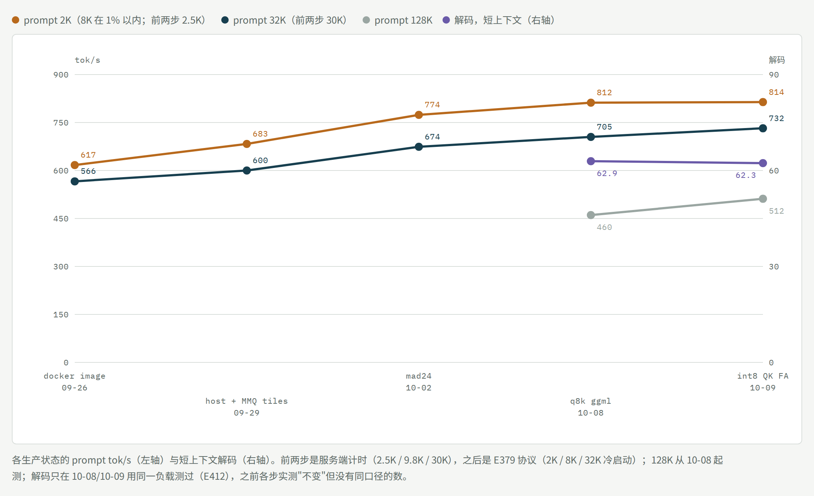
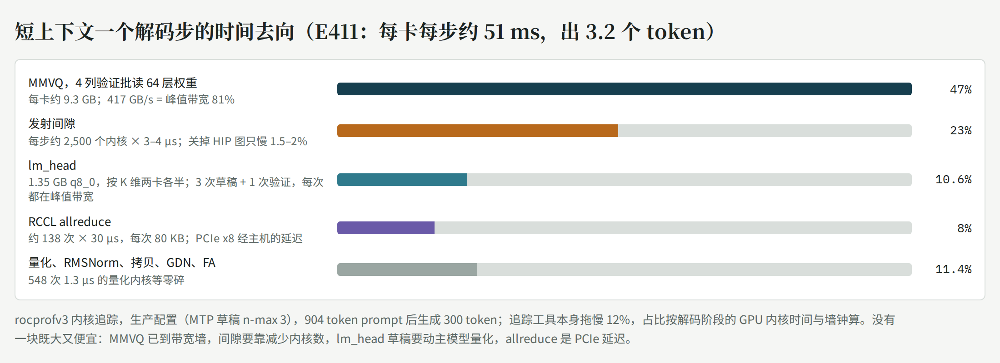

# dual-6900xt-flash-next-tuning（中文）

[English](README.md) · **交互版时间线：https://vop3p.github.io/dual-6900xt-flash-next-tuning/** （每一步可按思路筛选）

<picture>
  <source media="(prefers-color-scheme: dark)" srcset="docs/now-zh-dark.png">
  
</picture>

<picture>
  <source media="(prefers-color-scheme: dark)" srcset="docs/speed-chart-dark.png">
  
</picture>

*各生产状态的读 prompt（4K、32K–37K、128K，左轴）和解码（右轴）tok/s。各点来自不同实验、条件不完全相同（前两步的 4K 点是 5K prompt；其余见交互页图下说明）；虚线段表示那一步没测这个指标。*

在一台家用机器（**2× AMD RX 6900 XT，gfx1030，各 PCIe 4.0 x8 / Ryzen 5 5600X / 128 GB DDR4**，ROCm 10.0）上跑 **Qwen3.8-Flash-Next（GSQ-RCO IQ3_S）** 的调优记录，从 llama.cpp 到 [Strata](https://github.com/Niko1221/Strata)，2026-09-21 → 10-08。

`patches/llama.cpp/` 是基于上游 `159c651f5` 的 8 个 llama.cpp 补丁：1–7 是时间线里 `q8k ggml` 那一步背后的 RDNA2 MMQ 工作（更宽的 tile、mad24 缩放、Q8_K 式激活、dot 链头 VOP3P），8 是 q8_0 K cache 的 int8 QK^T flash-attention tile 内核；编译选项和实测见[其 README](patches/llama.cpp/README.md)（英文）；Strata 通过 `-DSTRATA_GGML_DIR` 吃到 MMQ 那几个。这些补丁都是在同一台机器用 llama.cpp 跑的稠密 **Qwen3.8-27B** 上做出来的，那条线见[第 4 节](#4-同一台机器上的稠密-27bqwen38-27bud-q5_k_xlllamacpp-qwen38-tp)。

**许可**：llama.cpp 补丁（`patches/`）和脚本（`bench/`）是 MIT，与 llama.cpp 相同，可以直接拿走、合并、随软件分发；文字、图和测量数据是 CC BY-NC 4.0（署名、禁止商用）。见 `LICENSE`；`CITATION.cff` 可直接引用。

<picture>
  <source media="(prefers-color-scheme: dark)" srcset="docs/modes-chart-zh-dark.png">
  
</picture>

*单卡 vs helper vs 双卡分层（E388 / E388a，0.1.41，32K，无图片编码器）：16 GB 单卡不管哪个树解码都是 48–52（约 4,500 专家槽、命中 83%）；helper 把解码提到 66–75、prompt 仍是单卡速度；分层两项都提，E387 解码配置再加最后一步到 82。*

`bench/` 是 A/B 骨架：`run_ab.sh`（每臂一个冷启动 server、全量日志、确认行核对）、`benchmark.py`（负载）、`ab_compare.py`（逐请求对比文本与速度）、`monitor_amd.py`（遥测采样）。路径是占位符，按自己的机器改。

Developed with an AI coding assistant; every number here was measured on the machine above.

---

# Flash-Next 调优时间线（2026-09-21 → 10-08）

[English](README.md) · 交互式时间线页面：`index.html`（GitHub Pages）

AiBox：2× RX 6900 XT（gfx1030，各 PCIe 4.0 x8）/ Ryzen 5 5600X / 128 GB，ROCm 10.0。模型 Qwen3.8-Flash-Next（GSQ-RCO IQ3_S 为主）。
实验编号（E…）对应作者的实验日志（未公开）；每条数字都是本机实测，推算的单独标明。

## 0. 结论（先看这里）

- **生产（10-09 00:16 起，解码配置换 E387；二进制 10-08 21:25 起）**：llama-swap `strata-split` / `strata-split-256k` = `strata-141-d14ca361`（Strata 上游 0.1.41 + 我们 7 个补丁 + llama-q2k 的 ggml）。回退槽 `strata-split-prev` = strata-q8k-4592281。
- **现在的速度**（E383/E385 的 P 臂，生产配置）：prompt 4K 968、32K 1,714、128K 2,041 tok/s，解码 77 / 82 / 76（E388，生产二进制 + `--spec 3 --spec-min-p 0.7 --pipeline-windows 2`，无图片编码器；生产带编码器时 128K ≈1,950，4K/32K 相同）；真实会话 93K 上下文长生成 97 tok/s。之前解码 66–75。
- **从 llama.cpp 到 Strata 的总账**（同一份 IQ3_S）：解码 26 → 66–75 tok/s（≈2.7×），37K/50K prompt 274 → 1,700（≈6×）。其中 Strata 本身换引擎占大头，之后我们的补丁和配置累计 prompt 约 +50%（714 → 1,433 → 1,705 → 1,711），解码约 +20%。
- **已经到地板的（别再试）**：解码的配置级杠杆**单独调**全部否定——`--kv-resident` 缩小（E382）、单开 `--pipeline-windows 2`（E384，+1–6%）、pipeline-windows 1 下的 `--spec`/`--spec-min-p` 16 点网格（E385/b，4/0.5 是峰值）；**但组合有效**：`--spec 3 --spec-min-p 0.7 --pipeline-windows 2` 解码 4K +10–16%、32K +8–11%（E387，三轮确认；短草稿接受率 83% vs 68%，第二窗的推测才命中），prompt 不变，输出跨启动不确定（基线是确定的），128K 在无编码器配置下 +11%（E388）；10-09 00:16 上生产；并发批槽对这台机器无益（常驻专家 41% < 上游门槛 50%，槽里不带 MTP）；IQ3_S 的 MMQ 分块/stream-K（E279/E280）；`--prefill` chunk 8192 即甜点（E296）；上游的 GDN 分块、Foresight、STAGE_PIN（上游自测对小卡无益或有害）。
- **还有空间的**：PCIe 拓扑换 x16+x4（大 prompt 约 1.5×，但 27B 的张量并行会崩，二选一，由用户定）；prompt 侧专家 GEMM / GDN / QSA 注意力 / hc 读各占 10–15%，每项都是内核级工作，≤10%。

## 1. 时间线

| 日期 | 事件 | 效果（实测） |
| --- | --- | --- |
| 09-21/22 | llama.cpp 专家 cache（E140–E146）：cache 56、inserts 8、MTP n-max 2 | 120K 解码 10.9 → 13.0 t/s；cache 链 >4 token 在 MMQ 崩 |
| 09-26 | `GGML_OP_OFFLOAD_MIN_BATCH=136`；PLE 直读构建 build-pleds | 冷 8K prefill +13–18%，主缺页归零 |
| 09-27 | E165 专家拷贝分两条 x8 | 只 +1–4%，层串行是瓶颈；流水线并行需重写调度器，未做 |
| 09-29 | QSA gather（`LLAMA_QSA_GATHER=1`，冻结 flash-next-qsa-fe7c12b19） | 96K 每验证步 −9.6%；gather 只在 decode/MTP 生效 |
| 09-30 | 新 alias flash-next-iq3s（GSQ-RCO IQ3_S + 112 槽） | 解码 −19–20%/步、prefill +17–22%（vs UD-Q4），命中 77% |
| 10-01 | 官方 MTP vs 自家稠密 MTP；Vulkan | 无可分辨差异；Vulkan 慢 55–90%，否决 |
| 10-02 | 生产换 flash-next-mtp-410e94c34（137 槽，上游 159c651f5） | 每步比 112 槽快 10–18%；数值噪声地板 KLD ≈0.025 |
| **10-04** | **Strata 引擎到位**（E215/E216，HIP gfx1030） | 同 IQ3_S 5K 提示词解码：llama.cpp 26 → split 56–58 → helper 62–63；37K prefill 274 → 714 |
| 10-04 02:30 | 上线 strata-split / strata-helper（strata-132a522，HIP 优化：FP16 输出 GEMM、QSA S4） | 37K prefill split 1,433 / helper 978 |
| 10-04 17:00 | 升 0.1.39（strata-6add1a7）+ FP16 prompt 路径 → PR #835；#849/#854 | 9.9K split 906 t/s；helper 需 `--pcie-frac 0` |
| 10-04 21:00 | 读提示词第 1 层卡死可复现（~70%）→ 临时 `--adapt-every 100000` | 0/3 卡；根因追到 10-06 |
| 10-05 | 卡死根因链（E251–E264，issue #884）：MMQ + 主卡 adapt + SDMA 三者同时；CP 不放行 BARRIER_AND | 关任一不卡；单硬件队列 0 卡但 prompt −30% |
| 10-05 15:32 | 生产 strata-238abe8（0.1.39 + #835/#849/#854/#981 rocBLAS 表） | 50K prompt 1,495 → 1,705（+13–16%），解码不变 |
| 10-05 19:05 | `STRATA_IO_THREADS=128` + `--ple-io ram`（memlock 无限） | 首 chunk 等 PLE 568 → 10 ms，8K prompt −7.4% |
| 10-05 20:25 | 生产 strata-61c59fa（+#1007 select SGEMM） | 128K prompt +5% |
| 10-06 06:33 | **#884 最强线索：GFXOFF**（写 0 后 0/10 不卡）；knob 是引用计数（11:05 更正） | 之后用 gfxoff-guard，再换 kernel-copy |
| 10-06 09:42 | 0.1.40.1 基线（E335） | split prompt 745 → 1,455（F16），解码 58.6 → 64.5（SH_STREAM） |
| 10-06 18:04 | 生产 strata-341922e（0.1.40.1 + #1149/#1150/#1151 + rocBLAS 表，env SH_STREAM=1、PROMPT_F16=1） | 128K split 2,003 tok/s |
| 10-06 19:10 | `STRATA_HIP_ADAPT_KERNEL_COPY=1` 绕 128K 停转，撤 gfxoff-guard（省电） | 0/3 vs 3/3 停转，无速度代价 |
| 10-06 22:20 | split 两槽开图片（自编 HIP strata-vision） | 主卡缓存 −11%，32K prompt −3.6% |
| 10-07 16:54 | 生产 strata-4592281（0.1.40.2 + rocBLAS 解本机缓存） | 速度持平，选解不再随启动变化 |
| 10-07 晚 | #1151 改为 SIMT 打分核（上游 65ce329 移植） | 128K prompt +7.4%，逐字节一致 |
| 10-07 22:10 | 图片编码器挪到 HIP0（分层 0–26/27–47，主卡缓存 5,256 → 6,123 槽） | 32K prompt +2.8–3.8% |
| 10-08 | strata-ud-q4 槽（UD-Q4_K_XL，K-quant MMQ 在 HIP 跑通） | 解码 −38%、32K prompt −3% vs IQ3_S，只用于比质量 |
| 10-08 19:25 | 生产 strata-q8k-4592281：ggml 换 llama-q2k（MMQ q8_0/iq3_s 链头 VOP3P，E378） | iq3_s 内核 +2.6% → 32K prompt +1.4–1.5%，输出逐字相同 |
| 10-08 20:30 | E382 `--kv-resident` 32K → 16K | 专家槽只 +0.7%，32K 解码 −3%，否决 |
| 10-08 21:25 | **生产 strata-141-d14ca361**：上游 0.1.41 + 7 补丁 rebase（无冲突） | 12 条输出逐字相同、速度 ±0.5%、0 停转；json 加 `gpu_order: as_given` |
| 10-09 04:47 | E391–E394：四条外来线索全部否定 | `--prefill auto:16384`（#1640）32K −14%；短 prompt 切 2048（#1441 思路）4K −9%；#1123 FP32 SGEMM 在 F16 开着时零调用、F16 关时 +66/+73%（10-06 已测过同款，正文已引用）；相位计时 F16 在 hc/qsa proj 都快一倍，不合并 |
| 10-09 04:03 | E388a 0.1.41 单卡 / helper 六臂（补齐报告） | 单卡 PRs 976/1,174/1,147、解码 49–51；helper PRs 986/1,173/1,147、解码 72–75；stock 比 0.1.40.1 +3–6%，两开关 +5–13%，PRs +1–2%；0 停转 |
| 10-09 00:16 | **E387 配置上生产**（strata-split / -256k：`--spec 3 --spec-min-p 0.7 --pipeline-windows 2`，备份 *.bak-2026-10-09-before-e387） | 经 llama-swap 实发 7K 请求：确认行出现，分层 0–26/27–47，prompt 1,019、解码 73.4，草稿接受 92% |
| 10-09 00:13 | E388 0.1.41 社区报告（split 五臂，无图片编码器） | stock 0.1.41 比 0.1.40.1 stock prompt +4–6%（464/767/869），两开关 +5/+12/+12%（832/1,619/1,823），PRs 持平（968/1,714/2,029）；kernel-copy 无代价、stock 128K 不停转；E387 解码配置 +19/+20/+11%（77/82/76） |
| 10-08 23:42 | E387 `--spec 3 --spec-min-p 0.7 --pipeline-windows 2` | 解码 4K 66 → 73–77、32K 74 → 80–83（+8–16%，三轮），prompt 不变；输出跨启动不确定；候选 |
| 10-08 21:27 | E384 `--pipeline-windows 2` | 解码 +1–6% 但跨启动输出不确定（2/7 同），4K prompt −1–5%，否决 |
| 10-08 21:50 | E385/E385b `--spec`×`--spec-min-p` 16 点 | 只有 5/0.6 在 32K +2.5%（单轮），其余全负；4/0.5 保留 |
| 10-08 22:50 | 并发批槽评估 | 常驻专家 41% < 上游门槛 50%，槽里不带 MTP，不做 |

## 2. 机制上学到的

- Strata 的专家 prompt 矩阵乘就是 llama.cpp 的 MMQ（`moe_mmq.cu`），所以 llama.cpp 侧的 MMQ 改动可以通过 `STRATA_GGML_DIR` 直接带入；rocBLAS 表和 SIMT 只管稠密投影和 QSA 打分。
- 解码每窗 33 ms 是两卡层分段串行的固定开销，速度 = 每窗接受的 token 数 ÷ 窗口时间；草稿更长或 min-p 更低接受率掉，更短或更高窗口截短，4/0.5 正好在峰值。
- Flash-Next 的 KV 常驻窗口只占一百多 MB，不是显存大头；显存大头是专家缓存（主卡 6,123 槽），prompt 和解码都直接跟着槽数走。
- Strata 能把 KV 放 RAM 是因为 QSA 稀疏（98.7% 块读命中 VRAM）；全注意力模型（qwen38-tp）没有这条路。
- GFXOFF 与 ROCm CP barrier 的交互是卡死的根（#884、drm/amd #5945）；缓解靠 kernel-copy，不靠 guard。
- 分层边界本身是个解码旋钮：去掉图片编码器后第二卡多 1.7 GiB，自动分层从 0–26/27–47 变成 0–24/25–47，32K 解码 74 → 69（−8%），命中率反而更高；开 pipeline-windows 2 后两种分层都到 82（E388）。没扫过手动 `layer_split`。

## 3. 我在这个题目上犯过的错

- 把 `amdgpu_gfxoff` knob 当电平用（它是引用计数），E335–E338 的"默认开"臂全部作废（10-06）。
- 读 split 计时行时把"整条调用"那张卡的等待当成计算，读错一轮（E361）。
- 以为 KV 常驻窗口占大块显存，没先算就开了 E382（结果只多 40 槽）。
- 测上游 PR 前先通读正文、再搜自己日志里它和它前身的编号——#1123 跑了三轮才发现 10-06 在 #1006 上测过、正文还引用了我们的数字（E392）。
- E384/E385 各扫完一个单变量就宣布"否定"，没想到两个旋钮有交互，组合是 +10–16%（E387）。
- 对 `--pipeline-windows` 预期 +10–30%，实测 +1–6% 且输出不确定；预期是按"省掉一段"算的，没考虑猜中率受每窗 2.3 token 限制。
- 升级前没逐条核对旧版本地补丁，0.1.39 升级后 helper 掉到 39 t/s（10-04 19:40）。
- 新建对比构建没 diff CMakeCache，漏了 STRATA_PREFILL_MMQ=ON 导致二分作废（10-04）。

## 4. 同一台机器上的稠密 27B：Qwen3.8-27B（UD-Q5_K_XL），llama.cpp `qwen38-tp`

同样两张卡还用 llama.cpp 跑稠密的 Qwen3.8-27B：`-sm tensor`（RCCL allreduce 走两条 x8 经主机）、q8_0 KV、196K 上下文、MTP 草稿（`--spec-draft-n-max 3`）、3 个槽。全注意力模型，Strata 那套专家缓存 / KV 流式都用不上；上面的 llama.cpp 补丁就是在它身上做的，补丁 8 只为它而存在。它不在交互式时间线页面里。

<picture>
  <source media="(prefers-color-scheme: dark)" srcset="docs/q38-now-zh-dark.png">
  
</picture>

**现状（10-09 15:10）**：生产二进制 = 上游 `159c651f5` + 补丁 1–8，env `GGML_FATTN_KQ8=1`。prompt 8K 以内 740–820 tok/s，32K 731，128K 512；解码短上下文 62 tok/s（MTP：每步约 51 ms 出 3.2 个 token），32K 深度 44，128K 25–28。KLD 对 bf16 0.003704，top-1 一致率 97.29%（同一量化用原版内核：0.003941 / 97.32%）。针 32K 8/8、128K 4/4。196K 上下文每卡显存 15.8 GB。

<picture>
  <source media="(prefers-color-scheme: dark)" srcset="docs/q38-speed-zh-dark.png">
  
</picture>

| 日期 | 这一步 | 实测效果 |
| --- | --- | --- |
| 09-26 | E157：选 v3 UD-Q5_K_XL 而不是 UD-Q4_K_XL（对 54 GB bf16 基准算 KLD，64×512 中英混合语料） | 0.0039 vs 0.0116；Q4 快 10.5%、每卡省 1.2 GiB；选了精度 |
| 09-27 | E152：在宿主上复现生产数字 | `--cache-ram 0` 会关掉空闲槽缓存，`-kvu` 下新请求慢 30–40%——差点得出四个假结论；复现必须逐项复制参数，包括缓存类 |
| 09-29 | 宿主二进制替代 docker 镜像；RDNA2 K-quant MMQ tile（补丁 2；扫描里 K512 变体快 1.9× 但真实形状算错，否决） | prefill 2.5K 617→683、9.8K 623→677、30K 566→600；逐位相同；解码不变 |
| 10-02 | mad24 缩放乘法（补丁 3） | prefill +8–9%，逐位相同，解码 −1% |
| 10-02 | E200b 分时，10K prefill：MMQ 64–67%、RCCL ≤13%、FA 5%、GDN 5% | K-quant MMQ 比 q8_0 慢约 40%，来源是每子块的浮点缩放 → 激活布局成为目标（10-08 做成） |
| 10-08 | Q8_K 式 MMQ 激活 + dot 链头 VOP3P（补丁 4–6） | prefill +4.6–6.1%（2K 774→812、8K 773→811、32K 674→705）；KLD 0.003941→0.003736；弯路：每 256 值一个缩放（KLD +25%）、k01 展开（>1000 VGPR）、q4_K/q5_K 上用 VOP3P 链头（−10%） |
| 10-08 | E377 内核级分时：MMQ 60–72%、allreduce 14–16%（BF16，每层 2 次，已是 PCIe 速度）、FA 2%@2K → 17%@32K、GDN 5–6% | FA 是长上下文的目标 |
| 10-08 | E381 FA tile 内核参数扫描（nbatch_fa、nbatch_K、占用率、线程数，10 个点） | 上游默认就是 gfx1030 上的局部最优，没有一点 >+3%；内核卡在 fp16 峰值的 35% 是结构（每 32 列 × 64 key 的 LDS 复用、half2 打包）不是参数 |
| 10-09 | **FA tile 内核 int8 QK^T**（补丁 8；E406–E410，一天） | 内核 16K/64K 1.31×；端到端 prefill 32K +3.3–3.9%、128K +11.1%、2K/8K 持平；解码/显存不变；KLD 0.003704；15:10 上生产 |
| 10-09 | E411 解码分时（短上下文，生产配置，rocprofv3；追踪工具本身拖慢 12%） | 饼图见下；MTP 值 2.1×（25.7 → 62 tok/s）；HIP 图在用但只值 2%（E411b） |
| 10-09 | E412 新旧二进制短上下文对照 | 解码两边都 62 ±1%，904 token prompt 持平——补丁 8 不碰解码 |

**短上下文一个解码步的时间去向（E411，每卡每步约 51 ms，3.2 个 token）：**

<picture>
  <source media="(prefers-color-scheme: dark)" srcset="docs/q38-decode-zh-dark.png">
  
</picture>

| 块 | 占比 | 离硬件上限 |
| --- | --- | --- |
| MMVQ，4 列验证批读 64 层权重（每卡约 9.3 GB） | 47% | 417 GB/s = 峰值带宽的 81% |
| 发射间隙（每步约 2,500 个内核 × 3–4 µs） | 23% | `-sm tensor` 的 meta 后端把每步切成约 130 个子图（每个 allreduce 一段），每张 HIP 图只装十几个内核——关掉图只慢 1.5–2% |
| lm_head（1.35 GB q8_0，按 K 维两卡各半；3 次草稿 + 1 次验证） | 10.6% | 每次都在峰值带宽；草稿那 3 次占 8% |
| RCCL allreduce（约 138 次 × 30 µs，每次 80 KB） | 8% | PCIe x8 经主机的延迟 |
| 量化（548 次 × 1.3 µs）、RMSNorm、拷贝、GDN、FA | 约 10% | 零碎小内核 |

没有一块既大又便宜：MMVQ 已到带宽墙；间隙要靠减少内核数（把 1–4 µs 的小内核融合，预期 +5–8%）或把 allreduce 做进图里整步一张图（后端改动，上限 +15–20%，未实测）；草稿的 lm_head 只能换更小的 `output.weight` 量化（动主模型）；allreduce 是 PCIe 延迟。

**27B 上已经关掉的方向（实测）**：SGLang 同位宽单路不比 llama.cpp 快（E174，之前的 +6–12% 是 Q4 vs Q5）；Vulkan；`-ub 2048`（prompt +4–8% 但上下文得降到 131K）；`-np 1`（单路无收益）；FA tile 参数空间（E381）；MMVQ（已到带宽 81%）；HIP 图开关（2%）。

**这条线上犯过的错：**

- 宿主复现时 `--cache-ram 0`（E152）差点出四个错结论；缓存类参数一个都不能漏。
- int8 原型前四版（1.04–1.11×）被当成思路的上限，其实是把 Q 的缩放放寄存器导致的溢出（256 VGPR + 31 次 spill）。判断一个内核思路之前先看 ISA / VGPR 数。
- int8 的精度爆炸（KLD 0.059、最大 20）在量化器里追了几小时（离群维度、旋转、SmoothQuant），真因是 `launch_fattn` 的 split-KV 合并路径——int8 内核的 LDS 占用把它触发了；上游 f16 内核强制走同一条路也掉精度。先读发射器，再动量化器。
- 两条实验链共用一个脚本和构建目录，产出的二进制和日志写的不是一回事（两组读数作废）；一次只跑一条链。
- 用 `sed` 叠加宏开关删掉了一个真正的 `#define`；宏变体应各自成提交。
- rocprofv3 下 `llama-server` 不响应 SIGINT/SIGTERM（追踪器的信号处理），追踪库其实早已落盘，白等 30 分钟。库出现后直接 SIGKILL。
- E411 的证伪条件（"内核时间 < 墙钟 60%"）满足了，却回答不了"切哪块"；条件应写成"最大块 ≥30% 且离硬件上限 ≥25%"。

## 5. 仓库里的 27B 原始材料

`bench/results/e410`、`e411`、`e412`：补丁 8 的 P/F 冷启动交替 A/B（脚本、报告、KLD/perf 运行）、rocprofv3 解码饼图与间隙分析（脚本及其文本输出；300–800 MB 的追踪库不含）、新旧二进制短上下文对照。
