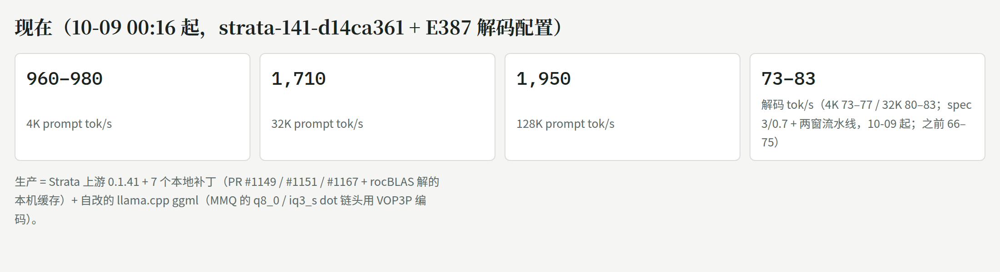
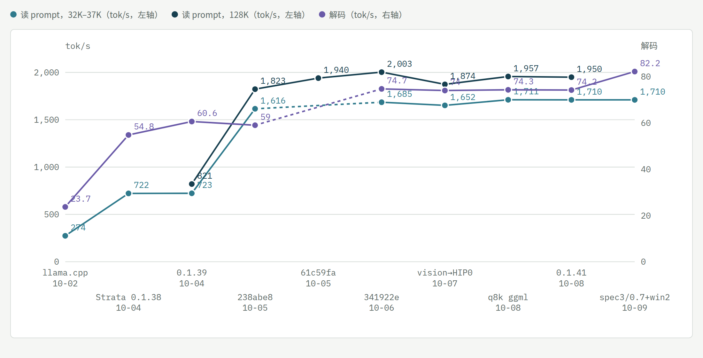

# dual-6900xt-flash-next-tuning（中文）

[English](README.md) · **交互版时间线：https://xjc10.github.io/dual-6900xt-flash-next-tuning/** （每一步可按思路筛选）

<picture>
  <source media="(prefers-color-scheme: dark)" srcset="docs/now-zh-dark.png">
  
</picture>

<picture>
  <source media="(prefers-color-scheme: dark)" srcset="docs/speed-chart-dark.png">
  
</picture>

*各生产状态的读 prompt（32K–37K 与 128K，左轴）和解码（右轴）tok/s。各点来自不同实验、条件不完全相同，交互页图下有说明；空心点表示那一步没测这个指标。*

在一台家用机器（**2× AMD RX 6900 XT，gfx1030，各 PCIe 4.0 x8 / Ryzen 5 5600X / 128 GB DDR4**，ROCm 10.0）上跑 **Qwen3.8-Flash-Next（GSQ-RCO IQ3_S）** 的调优记录，从 llama.cpp 到 [Strata](https://github.com/Niko1221/Strata)，2026-09-21 → 10-08。

`patches/llama.cpp/` 是时间线里 `q8k ggml` 那一步背后的 6 个 llama.cpp 补丁（RDNA2 MMQ：更宽的 tile、mad24 缩放、Q8_K 式激活、dot 链头 VOP3P），基于上游 `159c651f5`，编译选项和实测见[其 README](patches/llama.cpp/README.md)（英文）；Strata 通过 `-DSTRATA_GGML_DIR` 直接用上。

`bench/` 是 A/B 骨架：`run_ab.sh`（每臂一个冷启动 server、全量日志、确认行核对）、`benchmark.py`（负载）、`ab_compare.py`（逐请求对比文本与速度）、`monitor_amd.py`（遥测采样）。路径是占位符，按自己的机器改。

Developed with an AI coding assistant; every number here was measured on the machine above.

---

# Flash-Next 调优时间线（2026-09-21 → 10-08）

[English](README.md) · 交互式时间线页面：`index.html`（GitHub Pages）

AiBox：2× RX 6900 XT（gfx1030，各 PCIe 4.0 x8）/ Ryzen 5 5600X / 128 GB，ROCm 10.0。模型 Qwen3.8-Flash-Next（GSQ-RCO IQ3_S 为主）。
实验编号（E…）对应作者的实验日志（未公开）；每条数字都是本机实测，推算的单独标明。

## 0. 结论（先看这里）

- **生产（10-09 00:16 起，解码配置换 E387；二进制 10-08 21:25 起）**：llama-swap `strata-split` / `strata-split-256k` = `strata-141-d14ca361`（Strata 上游 0.1.41 + 我们 7 个补丁 + llama-q2k 的 ggml）。回退槽 `strata-split-prev` = strata-q8k-4592281。
- **现在的速度**（E383/E385 的 P 臂，生产配置）：prompt 4K ≈ 960–980 tok/s、32K ≈ 1,710、128K ≈ 1,950；解码 73–83 tok/s（4K 73–77 / 32K 80–83；`--spec 3 --spec-min-p 0.7 --pipeline-windows 2`，10-09 00:16 起；之前 66–75）。
- **从 llama.cpp 到 Strata 的总账**（同一份 IQ3_S）：解码 26 → 66–75 tok/s（≈2.7×），37K/50K prompt 274 → 1,700（≈6×）。其中 Strata 本身换引擎占大头，之后我们的补丁和配置累计 prompt 约 +50%（714 → 1,433 → 1,705 → 1,711），解码约 +20%。
- **已经到地板的（别再试）**：解码的配置级杠杆**单独调**全部否定——`--kv-resident` 缩小（E382）、单开 `--pipeline-windows 2`（E384，+1–6%）、pipeline-windows 1 下的 `--spec`/`--spec-min-p` 16 点网格（E385/b，4/0.5 是峰值）；**但组合有效**：`--spec 3 --spec-min-p 0.7 --pipeline-windows 2` 解码 4K +10–16%、32K +8–11%（E387，三轮确认；短草稿接受率 83% vs 68%，第二窗的推测才命中），prompt 不变，输出跨启动不确定（基线是确定的），128K 在无编码器配置下 +11%（E388）；10-09 00:16 上生产；并发批槽对这台机器无益（常驻专家 41% < 上游门槛 50%，槽里不带 MTP）；IQ3_S 的 MMQ 分块/stream-K（E279/E280）；`--prefill` chunk 8192 即甜点（E296）；上游的 GDN 分块、Foresight、STAGE_PIN（上游自测对小卡无益或有害）。
- **还有空间的**：PCIe 拓扑换 x16+x4（大 prompt 约 1.5×，但 27B 的张量并行会崩，二选一，由用户定）；prompt 侧专家 GEMM / GDN / QSA 注意力 / hc 读各占 10–15%，每项都是内核级工作，≤10%。

## 1. 时间线

| 日期 | 事件 | 效果（实测） |
| --- | --- | --- |
| 09-21/22 | llama.cpp 专家 cache（E140–E146）：cache 56、inserts 8、MTP n-max 2 | 120K 解码 10.9 → 13.0 t/s；cache 链 >4 token 在 MMQ 崩 |
| 09-26 | `GGML_OP_OFFLOAD_MIN_BATCH=136`；PLE 直读构建 build-pleds | 冷 8K prefill +13–18%，主缺页归零 |
| 09-27 | E165 专家拷贝分两条 x8 | 只 +1–4%，层串行是瓶颈；流水线并行需重写调度器，未做 |
| 09-29 | QSA gather（`LLAMA_QSA_GATHER=1`，冻结 flash-next-qsa-fe7c12b19） | 96K 每验证步 −9.6%；gather 只在 decode/MTP 生效 |
| 09-30 | 新 alias flash-next-iq3s（GSQ-RCO IQ3_S + 112 槽） | 解码 −19–20%/步、prefill +17–22%（vs UD-Q4），命中 77% |
| 10-01 | 官方 MTP vs 自家稠密 MTP；Vulkan | 无可分辨差异；Vulkan 慢 55–90%，否决 |
| 10-02 | 生产换 flash-next-mtp-410e94c34（137 槽，上游 159c651f5） | 每步比 112 槽快 10–18%；数值噪声地板 KLD ≈0.025 |
| **10-04** | **Strata 引擎到位**（E215/E216，HIP gfx1030） | 同 IQ3_S 5K 提示词解码：llama.cpp 26 → split 56–58 → helper 62–63；37K prefill 274 → 714 |
| 10-04 02:30 | 上线 strata-split / strata-helper（strata-132a522，HIP 优化：FP16 输出 GEMM、QSA S4） | 37K prefill split 1,433 / helper 978 |
| 10-04 17:00 | 升 0.1.39（strata-6add1a7）+ FP16 prompt 路径 → PR #835；#849/#854 | 9.9K split 906 t/s；helper 需 `--pcie-frac 0` |
| 10-04 21:00 | 读提示词第 1 层卡死可复现（~70%）→ 临时 `--adapt-every 100000` | 0/3 卡；根因追到 10-06 |
| 10-05 | 卡死根因链（E251–E264，issue #884）：MMQ + 主卡 adapt + SDMA 三者同时；CP 不放行 BARRIER_AND | 关任一不卡；单硬件队列 0 卡但 prompt −30% |
| 10-05 15:32 | 生产 strata-238abe8（0.1.39 + #835/#849/#854/#981 rocBLAS 表） | 50K prompt 1,495 → 1,705（+13–16%），解码不变 |
| 10-05 19:05 | `STRATA_IO_THREADS=128` + `--ple-io ram`（memlock 无限） | 首 chunk 等 PLE 568 → 10 ms，8K prompt −7.4% |
| 10-05 20:25 | 生产 strata-61c59fa（+#1007 select SGEMM） | 128K prompt +5% |
| 10-06 06:33 | **#884 最强线索：GFXOFF**（写 0 后 0/10 不卡）；knob 是引用计数（11:05 更正） | 之后用 gfxoff-guard，再换 kernel-copy |
| 10-06 09:42 | 0.1.40.1 基线（E335） | split prompt 745 → 1,455（F16），解码 58.6 → 64.5（SH_STREAM） |
| 10-06 18:04 | 生产 strata-341922e（0.1.40.1 + #1149/#1150/#1151 + rocBLAS 表，env SH_STREAM=1、PROMPT_F16=1） | 128K split 2,003 tok/s |
| 10-06 19:10 | `STRATA_HIP_ADAPT_KERNEL_COPY=1` 绕 128K 停转，撤 gfxoff-guard（省电） | 0/3 vs 3/3 停转，无速度代价 |
| 10-06 22:20 | split 两槽开图片（自编 HIP strata-vision） | 主卡缓存 −11%，32K prompt −3.6% |
| 10-07 16:54 | 生产 strata-4592281（0.1.40.2 + rocBLAS 解本机缓存） | 速度持平，选解不再随启动变化 |
| 10-07 晚 | #1151 改为 SIMT 打分核（上游 65ce329 移植） | 128K prompt +7.4%，逐字节一致 |
| 10-07 22:10 | 图片编码器挪到 HIP0（分层 0–26/27–47，主卡缓存 5,256 → 6,123 槽） | 32K prompt +2.8–3.8% |
| 10-08 | strata-ud-q4 槽（UD-Q4_K_XL，K-quant MMQ 在 HIP 跑通） | 解码 −38%、32K prompt −3% vs IQ3_S，只用于比质量 |
| 10-08 19:25 | 生产 strata-q8k-4592281：ggml 换 llama-q2k（MMQ q8_0/iq3_s 链头 VOP3P，E378） | iq3_s 内核 +2.6% → 32K prompt +1.4–1.5%，输出逐字相同 |
| 10-08 20:30 | E382 `--kv-resident` 32K → 16K | 专家槽只 +0.7%，32K 解码 −3%，否决 |
| 10-08 21:25 | **生产 strata-141-d14ca361**：上游 0.1.41 + 7 补丁 rebase（无冲突） | 12 条输出逐字相同、速度 ±0.5%、0 停转；json 加 `gpu_order: as_given` |
| 10-09 00:16 | **E387 配置上生产**（strata-split / -256k：`--spec 3 --spec-min-p 0.7 --pipeline-windows 2`，备份 *.bak-2026-10-09-before-e387） | 经 llama-swap 实发 7K 请求：确认行出现，分层 0–26/27–47，prompt 1,019、解码 73.4，草稿接受 92% |
| 10-09 00:13 | E388 0.1.41 社区报告（split 五臂，无图片编码器） | stock 0.1.41 比 0.1.40.1 stock prompt +4–6%（464/767/869），两开关 +5/+12/+12%（832/1,619/1,823），PRs 持平（968/1,714/2,029）；kernel-copy 无代价、stock 128K 不停转；E387 解码配置 +19/+20/+11%（77/82/76） |
| 10-08 23:42 | E387 `--spec 3 --spec-min-p 0.7 --pipeline-windows 2` | 解码 4K 66 → 73–77、32K 74 → 80–83（+8–16%，三轮），prompt 不变；输出跨启动不确定；候选 |
| 10-08 21:27 | E384 `--pipeline-windows 2` | 解码 +1–6% 但跨启动输出不确定（2/7 同），4K prompt −1–5%，否决 |
| 10-08 21:50 | E385/E385b `--spec`×`--spec-min-p` 16 点 | 只有 5/0.6 在 32K +2.5%（单轮），其余全负；4/0.5 保留 |
| 10-08 22:50 | 并发批槽评估 | 常驻专家 41% < 上游门槛 50%，槽里不带 MTP，不做 |

## 2. 机制上学到的

- Strata 的专家 prompt 矩阵乘就是 llama.cpp 的 MMQ（`moe_mmq.cu`），所以 llama.cpp 侧的 MMQ 改动可以通过 `STRATA_GGML_DIR` 直接带入；rocBLAS 表和 SIMT 只管稠密投影和 QSA 打分。
- 解码每窗 33 ms 是两卡层分段串行的固定开销，速度 = 每窗接受的 token 数 ÷ 窗口时间；草稿更长或 min-p 更低接受率掉，更短或更高窗口截短，4/0.5 正好在峰值。
- Flash-Next 的 KV 常驻窗口只占一百多 MB，不是显存大头；显存大头是专家缓存（主卡 6,123 槽），prompt 和解码都直接跟着槽数走。
- Strata 能把 KV 放 RAM 是因为 QSA 稀疏（98.7% 块读命中 VRAM）；全注意力模型（qwen38-tp）没有这条路。
- GFXOFF 与 ROCm CP barrier 的交互是卡死的根（#884、drm/amd #5945）；缓解靠 kernel-copy，不靠 guard。
- 分层边界本身是个解码旋钮：去掉图片编码器后第二卡多 1.7 GiB，自动分层从 0–26/27–47 变成 0–24/25–47，32K 解码 74 → 69（−8%），命中率反而更高；开 pipeline-windows 2 后两种分层都到 82（E388）。没扫过手动 `layer_split`。

## 3. 我在这个题目上犯过的错

- 把 `amdgpu_gfxoff` knob 当电平用（它是引用计数），E335–E338 的"默认开"臂全部作废（10-06）。
- 读 split 计时行时把"整条调用"那张卡的等待当成计算，读错一轮（E361）。
- 以为 KV 常驻窗口占大块显存，没先算就开了 E382（结果只多 40 槽）。
- E384/E385 各扫完一个单变量就宣布"否定"，没想到两个旋钮有交互，组合是 +10–16%（E387）。
- 对 `--pipeline-windows` 预期 +10–30%，实测 +1–6% 且输出不确定；预期是按"省掉一段"算的，没考虑猜中率受每窗 2.3 token 限制。
- 升级前没逐条核对旧版本地补丁，0.1.39 升级后 helper 掉到 39 t/s（10-04 19:40）。
- 新建对比构建没 diff CMakeCache，漏了 STRATA_PREFILL_MMQ=ON 导致二分作废（10-04）。
